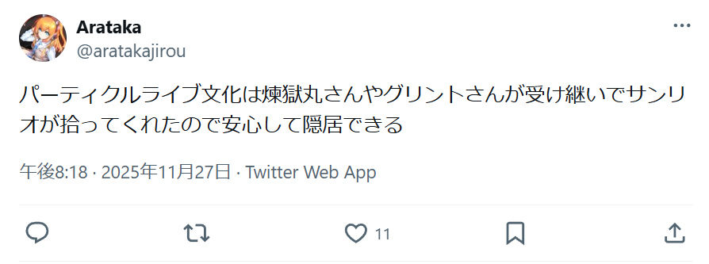

この記事は[**バーチャルケモミミ Advent Calender 2025**](https://adventar.org/calendars/12273)の10日目の記事です。

>「PaLASOLUはVRTLで生まれました。ツイッタラーの発明品じゃありません。バーチャルケモミミのオリジナルです。しばし遅れを取りましたが、今や巻き返しの時です」
>
>「パーティクルライブは好きだ」
>
>「パーティクルライブがお好き？　結構。ではますます好きになりますよ。さあさどうぞ(ｶﾞﾁｬ　PaLASOLUのニューモデルです」
>
>「快適でしょう？　ん、ああ仰らないで。Timeline変換が自動、でも手動アップロードなんて見かけだけで手間はかかるし、よくミスるわ、すぐ壊れるわ、ろくな事はない。 便利ツールもたっぷりありますよ、どんな用法の方でも大丈夫。(ｶﾞﾁｬ どうぞ動かしてみて下さい、いい音でしょう。余裕の音だ、馬力が違いますよ」
>
>「一番気に入ってるのは…」
>
>「何です？」
>
>**「値段だ」**
>
>「ああ、何を！　ああっ待って！　ここで動かしちゃ駄目ですよ！ 待て！　止まれ！　うぁあああ」(ArgumentException

<!-- truncate -->
====================

え、これは何？ まぁいいや。本日12月10日は、PaLASOLUの最も古いバージョン、[0.1.0](https://github.com/GlinTFraulein/PaLASOLU/releases/tag/0.1.0)がリリースされてからちょうど半年の記念日になります。

記念日ということで、ドキュメントとかに書くことでもないけど書いておきたい的な、PaLASOLUの設計思想とかについて書こうかな～って感じです。需要は私にあるので問題ないですね✨

[**PaLASOLUってなんやねんって人は、ここをクリックすると「PaLASOLUってなんやねん」的なページに飛びます。**](https://glintfraulein.info/PaLASOLU)

**なお、この後にバーチャルケモミミ要素はほとんどないです。**

## PaLASOLUの全体

PaLASOLUは、大きく分けて以下の3種類のモジュール(っていうのかな？)からなります。

- Setup Optimizer : パーティクルライブ作る用意をするやつ
- Low-effort Uploader : 脳死でアップロードできるようにするやつ
- それ以外 : 便利にするやつとかいろいろ

PaLASOLUの根底に流れる思想として、**パーティクルライブ制作の非本質を破壊する**、というものがあります。

私は、パーティクルライブが好きです。パーティクルライブ制作の最大のモチベーションも、パーティクルライブが観たいからだったりします。
ところで、パーティクルライブのメインである演出制作以外で躓いているのを見ると「もったいねぇ～～～～～～！！！！！！」ってなってしまいます。**世界の損失です。**

そんな世界の損失を防ぐために、PaLASOLUは生まれました。
「アバター改変におけるUnity的な側面を隠蔽する」Modular Avatarに近くて、「パーティクルライブ制作におけるアバターギミック的な側面を隠蔽する」PaLASOLUです。

> 例えばバラバラなワールド固定システム、VRCSDKのエラー、複雑なアップロード手順、この世にはなくなった方が幸せになれるものがたくさんあります。それらをPaLASOLUの力で消し去ります。

PaLASOLUの究極の目標は、**パーティクルライブを、もう少しだけ、人口に膾炙すること**です。

## PaLASOLUのSOの部分

[Setup Optimization ドキュメントページ](https://glintfraulein.info/PaLASOLU/Document/SetupOptimization)

Setup Optimization、略してSO。それでいいのか。

v1系以前とv2系以降で表面的に大きく内容が変化したSetup部分です。そして、**私が人生で初めて作ったUnity拡張**です。この記事公開の、ちょうど半年前に生まれました。

思想は単純で、「めんどくさいセットアップ手順を全て完結させる」こと、「パーティクルライブ文化圏のスタンダードセットアップを規定する」こと、これら2つです。

パーティクルライブ制作の非本質部分として、いくつか挙げられるものがあります。
- ワールド固定ギミックの作成/使用
- ON/OFFギミックの作成/使用
- Playable Directorコンポーネント/Timelineウィンドウの用意、ならびに習得
- VRChatへのアップロード時にPlayable Directorを外すこと

Setup Optimization(もしくは、ParticleLive Setup)では、「ワールド固定ギミック」「ON/OFFギミック」「Timelineウィンドウの用意」の3点を解決します。

### セットアップの簡略化
これはとても分かりやすく、上記3点のセットアップを1画面で完成させます。歴史に沿って、v1以前の話からしましょう。

先も述べた通り、PaLASOLUの根本思想は**パーティクルライブ制作の非本質を破壊する**ことです。
ここで、ワールド固定やON/OFFギミックのような演出に直接関わらない部分で時間を取られるのは非本質的であると考えています。パーティクルライブの本質は視聴覚演出であるはずです。

v1以前では、これらギミックがMAを用いてセットアップされたPrefabをScene上に召喚し、ついでにTimelineウィンドウがすぐに使えるようにPlayable DirectorとTimelineファイルのセットアップまで一括で済ませるようにしました。
実際、これは(自分で使っていても)大きな時短になりますし、"Timeline Lock Notice"によってTimelineウィンドウの使い方の啓蒙も一気に行えるという優れモノです。

しかし、問題がありました。
ワールド固定ギミックとON/OFFギミック、そしてそれらをMA経由でアバターに搭載するためのメニュー用GameObjectがHierarchy上に散乱してしまいます。

私が自分で使う分には問題ありません。しかし、Rootオブジェクトの2階層下にPlayable DirectorコンポーネントがついたGameObjectがあるという状態は、初学者にとって直感的ではありません。
それだけではなく、私が使い方などをレクチャーする際にこの「2階層下」を口頭で説明することに無視できない時間がかかっていました。**非本質的な部分に時間がとられています。嬉しくないです。**

v2は特にこの状況を解消するために行った、破壊的アップデートです。実は重実装のLUではなく、SO側からの要請でメジャーバージョンが上がっていました。

v2では、先とは違い、各種ギミックをSceneに配置**しません**。配置されるのはただ一つ、Timelineが使えるようにPlayable DirectorコンポーネントがセットアップされたGameObjectひとつです。
では、各種ギミックはどこへ行ったのかというと、**ビルド時に半動的にギミックを生成します。**(実際は、ギミックの半動的生成は後述するLow-effort Uploaderが担うようになりました。)

これは「アバターギミック的側面の隠蔽」に強くつながる部分であり、本質部分の制作にとってノイズになる部分を徹底的に削ぎ落した、ひとつの完成形だと思っています。
ワールド固定ギミックの想定観客位置はシンプルな白い棒になっているのですが、改変したい人向けにv1以前の挙動に近づける「Advanced Setup」オプションも残しています。

### スタンダードの規定
> 私が使い方などをレクチャーする際にこの「2階層下」を口頭で説明することに無視できない時間がかかっていました。

実はPaLASOLUを作った理由のひとつに、「パーティクルライブ教育用パッケージが欲しい」というものがありました。

2025年というのは、パーティクルライブ界隈にとって"豊作"の年でした。それも過去に例を見ないほど。
たくさんの新人に囲まれ、どころか超強力新人も複数台頭し、界隈全体として過去最高クラスの熱を持っていました。(ちなみに前回特に熱かった年は2021年だった気がします。LuminaPaletteのメンバーの多くはパーティクルライブ2021年勢だったり。)

そんな中、「この熱気を無駄にするわけにはいかない。むしろこのチャンスをもっと加速させたい！」という想いからPaLASOLUの開発がスタートしました。6月8日のことでした。

しかし、私には圧倒的に時間が足りませんでした。
というのも、「6月11日にパーティクルライブが作りたい人向けのパーティクル講座してほしい！」という依頼を、
「6月19日から4～5回の授業ででパーティクルライブの作り方の連続講座をやってほしい！」という依頼をそれぞれ受けていました。

ところで、6月11日にはSOもLUも最低限動くv0.2.0を、6月19にはv1.0.0を公開することができたのですが……。よかったね。

これを無理やりにでも間に合わせていた理由こそが、「パーティクルライブ教育用パッケージが欲しい」という願い、そしてその裏に潜む「スタンダードセットアップの規定」という野望でした。

PaLASOLU以前、パーティクルライブをワールド固定する方法として比較的多く用いられていたのは[ConstraintWorldFixed](https://booth.pm/ja/items/1945236)、[ぱーちくるライブワールド固定MA](https://menou-store.booth.pm/items/4885956)、**自作**、あたりであったと認識しています。
これらが採用されていた理由は""歴史的経緯""が大きいです。なぜならこれらのアセットを作ったのは他でもない、パーティクルライバー各位だったからです。

MAが普及してからだいぶマシにはなったものの、特にCWFはMA以前からあるアセットですから、別途ON/OFFギミックのセットアップが必要でした。**昔懐かしのEmoteSwitchとかね！**

しかし、私はここの説明に時間を掛けたくなかったですし、複数種類のアセットを往来しての質問対応は負荷が高くなるだろうことは想像に難くありませんでした。
そこでPaLASOLUを特に初学者に向けて普及させることで、「新世代のスタンダード」となることを狙いました。し、今も狙い続けています。

そう、**PaLASOLUはそのツールだけでなく、ツールを広めること、教育を行うことまで含めて一つのプロジェクトとしてパッケージされています。**
実際、今年は直接・間接含めて、パーティクルライブを作れる人を50人以上増やしました。(たぶんちゃんと数えたら70～80くらいになると思います。)

幸いなことに、新世代のパーティクルライバーだけでなく、
- パーティクルライバー上弦の柱であるところの、毎月パーティクルライブイベントを開催する[煉獄丸](https://x.com/rengokmaru)さん
- パーティクルライブ向けアセット販売や、NHK『沼にハマって聞いてみた「VRの沼」』で作品が地上波に出た経験もある個性派パーティクルライブライバー[真あつき](https://x.com/atsuki17173305)さん
- 2024年最強パーティクルライバーの双璧が片翼、ド派手エフェクトや高度なギミックを得意とする[いるか](https://x.com/irukavrchat)さん

……など、さまざまな世代に言及して頂いたり、広めていただいたりしています。嬉しい限りです。

もちろん、[リア](https://x.com/Lia_vrc)さんの忘れじ→紡ぎ歌のような"スタンダードでない"状況には対応できませんが、「それはそれ」と思い込むことで解決しています。
ところでリアさんの作品はすごすぎるので観てください。

広報的な側面で言うと、そういえば今年の[『からぱり映画祭2025』で、協賛映像を出させていただきました。](https://youtu.be/7XsNg5rSyAo?si=TfzqVI7Qzsjcn5-P&t=144)
スクリーンに突然広がるUnity画面、流石にちょっと面白すぎました。(これによって少なくともPaLASOLUの利用者が1名増えた報告を受けていて、うれしいです。)

## PaLASOLUのLUの部分

[Low-effort Uploader ドキュメントページ](https://glintfraulein.info/PaLASOLU/Document/LoweffortUploader)

Low-effort Uploader、略してLU。それでいいのか2。内部ではLfUploaderと呼んでいたり。

v1からv2で大きく変わったSOに対して、LUの方は全然変わりません。というのも、基本的には「Playable Directorを外すこと」「それに伴うTimeline→Animationへのコンバート」がメインの役割だからです。
そして、**これがPaLASOLUの最も狂気じみた機能です。**

基本的な使い方は「付けるだけ」。それどころか、PaLASOLUからセットアップすれば自動でついてくるので、**ユーザーは認識する必要すらありません。**

「Timelineをそのままアップロードしたい」という、思想というか、祈りで作っています。

### 無駄で冗長で複雑な手順の破壊
さて、PaLASOLU以前からTimelineは使われており、アップロードのためにはPlayable Directorを外すために以下のことに気を付けていました。

- アップロード時、Timelineファイル内にある、AnimationClipのサブアセットを、Playable Directorを持つGameObjectにD&Dする(と、Animatorが生成される)
	- この操作をすることで、Playable Directorを消しても、Timelineに保存されたAnimationをVRCに持ち込めるようになる
- 必要に応じて、音声をAudioSourceとしてScene上に置く(と、勝手に流れるので必要に応じてTimeline側で先にON/OFFを制御しておく)
- ↑の手順を行うために、**AnimationTrack以外のトラックが一切使えない**

これら手順や注意はVRCのアバターでパーティクルライブを出すとき特有のもので、それ故にワールド・他プラットフォームとはある種隔絶された状態が続いていました。
アバター向けに作ったものを他に出すことはできますが、**逆は常にできることが保証されていません。**

PaLASOLUが最もやりたかったことの一つが、この手順の破壊です。
私も常々、アップロードして確認するたびにSceneを別で切って処理してアップロードして、確認したら元のSceneに戻って、という工程の無駄さを感じていました。

その結果、AnimationTrackだけでなく、Audio、Activate、(制限付きではあるものの)Control、と各Trackに対応するまでに成長しました。

とはいえ、やっていることはどこまでいっても"翻訳"であり、その裏に潜む苦労と長すぎるコードに比べて話す内容は少ないです。
その"翻訳"すら、まだ完全とは言い難いです。特にAnimationClipをAnimationTrackに置いたときの挙動や、Control Track周りの挙動がバグってるので……。

一応、v2以降はSOで説明していたギミック系の半動的生成をLUで持っています。
これが"半"動的と表現されている理由は、実際にやっていることが「既存のギミックPrefabを**置いて**、ギミックが使える状態にする」ということで、実体は作り置きしているためです。

PaLASOLUを通すことで、AnimationTrack以外のTrackが使える範囲が広がりました。ということは、ワールド・他プラットフォーム向けに作ったものでも、ある程度アバターに持ってきやすくなったはずです。
パーティクルライブにおける、アバターとワールドの溝が、これで少しでも埋まるといいなぁと思っています。

……と思っていますし、実際にワールドからアバターに持ってくる際に起きた不具合が報告されていたりします。修正しました。
このバグ報告の話をするなら、PaLASOLUはパーティクルライブに留まらず、アイドルグループなどのダンス発表会イベントの、いわゆるステージ演出とも切り離せない関係があるとも言えます。

**演出を一つのパッケージとして持ち出せるようにする**というのは、どこかModularな思想を感じられていいですね。
(故に、Avatar Motionへの対応が後手後手なんですけど……。)

ところで、LoweffortUploaderCoreはだいぶ肥大化してきました。一応、AudioUtilとかは別ファイルに分割していますが、そのうち大規模なリファクタリングが必要になるかもしれません。

### 影の立役者
VRCSDKは、アップロードできないコンポーネントがアバターやワールドについている場合、エラーを表示します。
SDK3.10.0時点ではアップロードボタン自体は押せますが、もちろんアップロードには失敗します。

Timelineを使うためのコンポーネントであるPlayable Directorも、当然アバターに含まれているとエラーを吐きます。通常は。
しかし、LU使用条件下では実はそうではありません。SDKのエラー表示をバイパスする仕組みがPaLASOLUには含まれています。
その秘密が、[AvatarValidationHarmonyPatch](https://github.com/GlinTFraulein/PaLASOLU/blob/master/Editor/AvatarValidationHarmonyPatch.cs)です。

これは、[anatawa12](https://nekolobby.niri.la/@anatawa12)さんに作っていただきました。感謝……！
ユーザーが触れる部分には何もないのでドキュメントにも記載がなく、折角の機会ということでここで紹介させていただきます。

確かに、「Timelineをそのままアップロードしたい」という祈りと、PaLASOLUが教育用パッケージとしても使われることを考えると、確認の必要のないエラーが出るのはいただけません。
それどころか、不要なエラーが出てしまうと本当に必要なエラーを見落としてしまうようになるかもしれません。これはいけません。

私も、ユーザーも、このたった57行のコードで快適性が極めて向上していると言ってよいでしょう。

## PaLASOLUのそれ以外の部分
パーティクルライブ制作に便利なツールとかを、ちょこちょこ生やしています。その紹介的なやつです。
[Extensionsはここにドキュメントが！](https://glintfraulein.info/PaLASOLU/Document/Extensions)

### PaLASOLU Avatar Menu (World Fixed)
> ワールド固定ギミックの想定観客位置はシンプルな白い棒になっているのですが、改変したい人向けにv1以前の挙動に近づける「Advanced Setup」オプションも残しています。

PaLASOLUはSOでワールド固定、ON/OFFギミックを明示的に生やすことをやめました。そのうえで、「Advanced  Setup」を忘れても当該Prefabを出せるようにしています。
なぜなら、私が一番うっかりさんだからです……。

確かこれは5分くらいで作りました。え？

### BPM to Second Frame Calculator
パーティクルライブで欠かせない要素、音ハメ。これは音ハメ用の電卓です。

元々は自分用に作っていたので、UI周りの作りが割と雑です。あと初見だとまぁ分からない。でも許してほしい。自分用のやつ移植してきただけなので……。

パーティクルライブってかなり頭がおかしくなる要素が含まれていて、

- Timeline上で使う「フレーム(1/60秒)」
- Particle System上でよく使う「秒」
- Particle SystemのRate Over Lifetimeなどで使う「1/秒」
- Particle System Curveで使う「Lifetime割合」

……といった形で、時間の単位がカオスに入り乱れています。これは頭がおかしくなります。あと説明も難しい。

元々は手元で計算したものをメモ用紙に記載しておいて、その値を使うということをずっと行っていましたが、流石にUnity上でできたほうが良いだろうということで実装しました。
PaLASOLUは現在アバター用のプロジェクトにしか入らないようになっていますが、主にこれがあるためにワールド用プロジェクトにもPaLASOLUを入れたくなっています。

### Img 2 Mat / Mat 2 Variant (by anatawa12)
> 「思い出の写真をたくさんパーティクルライブに入れたい！」「画像だけが違うたくさんの3Dモデルが欲しい！」などの場合に役立ちます。
>
> これら2つのツールは基本的にセットで使う想定です。
>
> なお、本Extensionsは制作者であるanatawa12氏より、zlibライセンスでの公開を特別に許諾していただいております。

うーん、全てを説明してしまいました。

これはVRCの学園系イベント[UniMagic](https://x.com/UniMagicVRC)の6期、パーティクルライブ科の中で生まれました。というかanatawaさんが作りました。
「流石に手作業100回やるなら、私がツール作ったほうが早い」ということみたいです。え？

PaLASOLUのライセンスはzlibですが、anatawaさんのツールは基本的にMITで公開されています。
ここについて相談したところ、anatawaさんが「私が特別に許可を出すことで対処します。クレジットだけ残してね。」という形で対処してくださったので、"よしなに"して、今の状態です。

### Fix rotation for "Create Particle System"
> 通常、UnityでParticleSystemを右クリックメニューから生成した場合、transform.rotate.x = -90の状態で生成されます。
>
> 本機能は、ParticleSystemが生成された瞬間に、transform.rotate.x = 0に修正します。
>
> ただし、「右クリックメニューから生成した場合」「Unityの画面上メニューの"GameObject"から生成した場合」以外は動きません。すなわち、パーティクルアセットなどを購入してPrefabを置いた場合などには機能しません。

うーん、全てを説明してしまいました。2

Particle Systemの、特にVelocity over Lifetimeの空間は「World」「Local」から選択できるようになっています。

しかし、現在もっとも使われているPerformance Spaceは、**Unity上でふつうアバターが向いている方向と、パーティクルライブを出す際に演者のアバターが観客の方を向く方向が逆**であるために、「World」空間で運用するならばアバターを180°Y軸回転させてから制作する必要があります。

これはめんどくさいので、「Local」空間で運用したいです。しかし、今度は**UnityでParticleSystemを右クリックメニューから生成した場合、`transform.rotate.x = -90`の状態で生成される**という問題が出てきます。
このために「Local」空間が90°回転している状態を強いられています。もちろん、`transform.rotate.x = 0`とすればよいですが、毎回すべて直すのはめんどくさいです。

そこでそれを全て自動で直そう！というのが、これです。

……が、若干バグってます。というのも、Create > ParticleSystemのコンストラクタに処理を入れられれば良かったのですが、どうやらそれが難しそうだったので**めちゃくちゃな実装**をしています。

- Particle Systemコンポーネントが付いていて
- `Regex("Particle System(?: \\(\\d+\\))?")`に名称が一致していて
- `Default-ParticleSystem`という名称のマテリアルが設定されていて
- Prefabに含まれていない

時に処理が発生します。これはデフォルトに見えますが、**初学者ほど、デフォルトでなくこの条件を踏む状況が発生しうる**ことが発覚しています。
私は便利に使っていますが、分からないまま使うと一見バグのような挙動を発生させるので、本機能はデフォルトOFFになっています。

コンストラクタに処理を挟む方法を知っている人、PRお待ちしております。

### Samples
PaLASOLUの機能を最速で体験するためのデモ置き場です。今後は「パーティクルライブを観る際の注意事項」とかを追加したいですね。

## PaLASOLUの展望
[PaLASOLUが機能的にやりたいことはIssueにまとめたのでここをクリックすれば読めますが、](https://github.com/GlinTFraulein/PaLASOLU/issues)折角なのでそれ以外のこととか。

- PaLASOLU Particle Pack
	- Paにパーティクルパックを付属させて、これだけでパーティクルライブ作成を始められるようにしたい
- PaLASOLU Animation Pack
	- 同上 VRMV系も作りやすくする土壌を整えたい(が、VRMV系って再利用性が低くて……)
	- PaLASOLU Easy Motion みたいなコンポーネントでもいいかもね
- PaLASOLUのドキュメントで、パーティクルライブの作り方を一通り学べるようにしたい
	- [テキスト資料はありますが](https://clytie.booth.pm/items/2762478)、流石に古いなぁと思うので令和最新版を残しておきたい
	- 同様に、動画コンテンツ、パーティクルライブでパーティクルライブの作り方を学べるコンテンツ & Samplesも欲しいね
- パーティクルライブ制作イベントをしたい
	- より積極的なアプローチ
	- でもやるなら↑の作り方を整えてからになるかなぁ
- **SEKAI - Stage Effect (KとAの中身決めてない) Interface**との連携
	- まだ作ってないツールの話してる……
	- どちらかというとワールド向け、ステージ演出向けの統合パッケージとしてSEKAIが欲しくて、PaLASOLUとの共通部分や連携部分も多くなる予感があります

まだまだやりたいことが多いというか、やり切れていないことが多いですね。

====================

最後に、一つだけツイートに言及して終わろうと思います。「パーティクルライブ」という単語を作った一人であり、PLV(Particle Live VRC)代表のAratakaさんのツイートです。

https://x.com/aratakajirou/status/1994002906677407856?s=20

確かに、私はそういった文化を受け継いだ一人かもしれませんが、**一人でしかありません。**
作る人がいて、観る人がいて、広める人がいて。そういって紡がれた文脈が、いつの日か文化と言われるまでになるのではないでしょうか。
そこに少しでも色を添えられていれば、私はとても嬉しく思います。

**私は、パーティクルライブと、それを取り巻く文化が大好きです。**

文化を作り上げてきた先達への感謝と、来年も再来年もその先も、ここで面白くて楽しいことが続けられることを祈って、〆とさせていただきます。