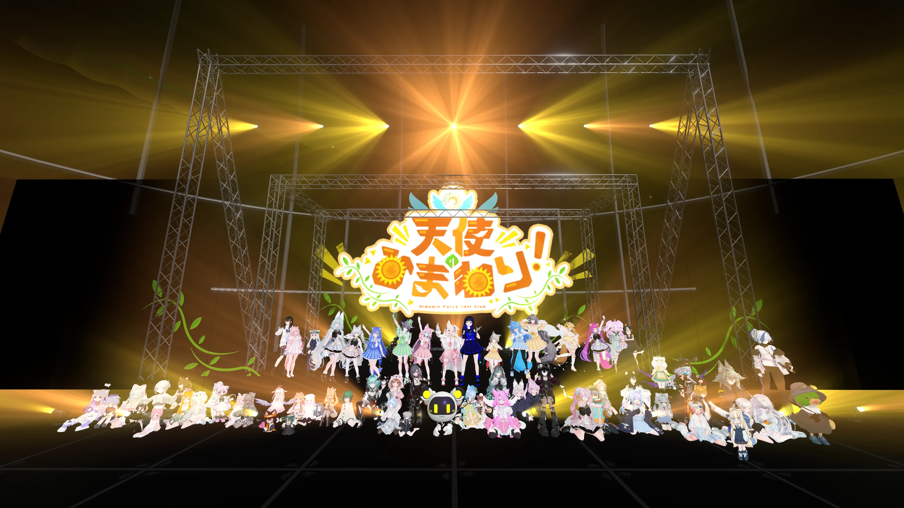
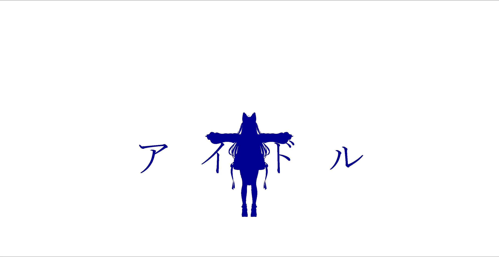
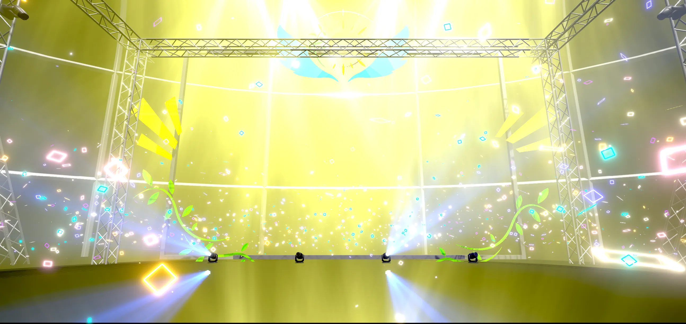
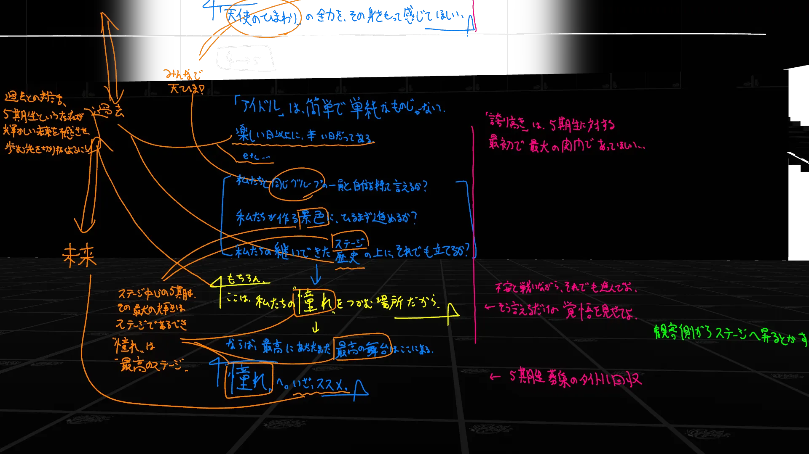
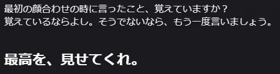

先日(3ヵ月ほど前)、天使のひまわり！5期生デビューライブを無事に完遂いたしました。当イベントでは、"Stage Director"もとい、ワールド作成、演出統括、ギミック開発、当日オペレーション等を担当しました。

今回の書き残しでは、今更な裏側を色々と書き連ねていこうと思います。書こうと思った理由は、突然書こうと思ったからです。

> なお、このような文章を書くことについては、天使のひまわり！プロデューサーのひまみんとさんより許可を……というか、「書いて！技術はガンガン共有しよう！OSS万歳！」みたいなことを言われていますので、安心してなんでもかんでも書きまくろうと思います。ヤバかったらDMをください……

<!-- truncate -->

# イベント概観

https://x.com/tenhima_vrc/status/2017523245667520926?s=20

2026年2月14日に行われた天使のひまわり！5期生デビューライブです。
コンセプトは、「**ここは、私たちの〝憧れ〟をつかむ場所。**」5期生募集の「"憧れ"へ。いざ、ススメ。」と共鳴する良いコンセプトだ……。

当日は終始80人フルインスタンスでの進行(!)、5曲+αのライブは大盛況のまま幕を下ろしました。そして、5期生ちゃん達の物語はここから始まっていきます。

# 演出班のおしごと

| 時期 | 内容 |
| ------ | ---- |
| 12月上旬 | 演出班キックオフミーティング |
| 12月中旬 ～ 1月上旬 | 重量級演出作成 |
| 1月上旬 ～ 1月中旬 | 軽量級演出作成 |
| 1月下旬 ～ 2月上旬 | 最終調整・ワールド実装 |

## キックオフミーティングに向けて

そういえば！この時期って新調したはずのPCが不具合になって動かない時期でした。で、PC帰ってくるのが一番遅いと2月頭くらいになりそう～……という中でのスタートをしていました。
実際には、PCは軽傷で割と早く直ったので事なきを得ていたのですが、それはまた別の話ということで……。

5期生募集があることに際してライブイベントが発生するのは確か11月頃から軽く相談を受けていて、それでいて本発進したのが12月上旬くらいでした。
ひまみんとプロデューサーとなんやかんや相談ののち、「統括班(私以外がいるとは言っていない)」という立ち位置を獲得しました。
後から思い返すと、この立ち位置は私個人的にはいろいろとやりやすかった反面、"正しく力を制御しないといけない"立場でもあったんだなぁと感じます。

あと、プロデューサーの「人脈広げたい」意図と、私の「演出思考を後継に仕込みたい」という意図が合致して、新たに[鈴木まや](https://x.com/Maya_Suzuki_VRC)さんと[すぅ](https://x.com/VRsuxu_23)さんを演出班に迎えて、"私が楽曲の演出を作らない"ことで、演出作成部隊は2名構成になりました。え？
あと当日VJしてくれる[らぎ汰](https://x.com/la86_)もいます。VJに関しては天ひま3rdの時とほぼ変わらないだろうと思っていたので、あまり心配はありませんでした。

ちなみに演出班の選定理由ですが、鈴木まやは「演出作らせろ～ なんかあったら呼んで～」と言われていたので、真っ先に呼びました。
パーティクルライバーとしての側面も持ちますが、特にビームライト系の演出を得意とします。~~通称"ビムラの山田"~~。

ビムラパワーについては概ね不足がないので、これと補完が効きそうな相方がいると嬉しいですね。
そういえばスクールダンス部の方で「もっと演出ちゃんと勉強したいな～、悔しい～」とか言っていた子がいた気がします。あぁ、そうです。それがすぅちゃんです。
向上心の強い新人(当時)で、パーティクル系の演出を得意とします。

というわけで、モチベ高くて補完のよく効く演出班ができました。あとは、頑張るって感じです。

## 最高の盛り上がりを作ろう

演出班キックオフミーティングのタイミングでは、まだセトリ全体は決まっていませんでした。全体が決まっていなかっただけで、後ろの方が決まっていました。
そしてどうやら、後ろ2曲は「全力でやっていい」らしいので、まずはここから作ろうね！という方針で固まりました。これが重量級演出作成。
鈴木まやが4曲目『誇り高きアイドル』を、すぅちゃんが5曲目『世界一かわいい私』を演出することになりました。

企画書には演出の要求とかもありましたが、「企画書は見ても見なくてもいい、まずは一旦自由にやりな！整合性は私が取る。」って感じにしました。
アイデアが出るならそれを活かしてほしいし、難しいなら企画書からアイデアを拾うといいよね、という気持ちのニュアンス。

もう一つ、この時点で4曲目と5曲目の間に幕間の物語が存在することは確定していて、「物語パートは私にやらせろ！」と言ってそこだけ私が作ることになりました。作りたかったので！

元々はこの重量級演出作成は1月下旬くらいまでもつれ込む可能性を想定していましたが、演出班2人のモチベが高すぎて、なんと年内には演出初期バージョンが提出されていました。すごい。
ってか我々12月30日、1月4日、1月7日に演出班会議してる。普通に年末年始進行やってて面白い。(これは1月2週目以降は私がVRCスクール15期に関わっていて会議時間が取れなさそうだった部分もありますが)

『誇り高きアイドル』の方は、1月上旬には概ね完成していました。いや、1月上旬までに2往復くらい演出監修を入れていました。音ハメ感とか、パーティクルの出し方の調整とか、その辺がメインだった気持ち。

『世界一かわいい私』の方は、確か3往復くらい演出監修を入れていました。ビムラとLightコンポーネントの関係だったり、光を操る演出考だったり、音の聞き方だったり。

実際はこういった往復の後で最後に私が"ごま塩"したものを提供しました。これも演出班の手が本当に早かったおかげで、最終調整に余裕が生まれたからできたことですね。ありがとう～

この瞬間とか。

このパーティクルとか。

## ようこそ5期生に光を添えて

一番の盛り上がりが作れれば、あとは簡単です。1～3曲目についてはそこまで演出強くなくてよいというオーダーだったので、「気楽にいこうね～」というノリでした。

- ハローラフター : 鈴木まや - ビムラだいたい完成させた後に汎用パーティクルに目を付けていた 過去と現在を繋いでいたんですねぇ～(適当)
- 青空のラプソディ : すぅ - パーティクルの使用を全面的にGO出したらキラキラした 実際それを期待して呼んだところあるため、はなまる
- ドレミファロンド : 鈴木まや - 1日で出てきた え？

本番1ヵ月前には、イベントが遂行可能な程度には全曲の演出が出揃っていました。すごい。じゃあ制作期間たったの1.5ヵ月で完走したってこと！？すごい。
ところで普段はイベント当日の夕方に完成上等！とか言ってますが……(カス)(最近は改善しています)

## 向日葵、時に驟雨に恵まれて。

https://soundcloud.com/glintfraulein/sunflowers_rainshower?si=7f521c3abd954d27ba4df1c8825468d5

物語パートの話をしましょう。というか半分ここを書くためにこの文章を書いています。上のリンクは物語パートのために生やしたBGM用楽曲です。作りました。

イベント全体の構成として、以下のような分析を持っていました。
- 1,2曲目で5期生が登場
- 3曲目で5期生と既存生が共演
- 4曲目で既存生が5期生に向かって「アイドル」を"叩きつける"
- ここに物語パートを挿入
- 5曲目で5期生が既存生に向けて、そして未来に向けての返歌を"見せつける"

イベント全体の構成として、そして **『天使のひまわり！』という文脈として**、この物語パートの重要性を感じていました。

イベント全体の体験設計に、そして **『天使のひまわり！』の何たるか**をこの場にいる全員に伝えることに、ものすごく深く関わってくる部分でした。

だからこそ、(なんだかんだ長く天ひまを支えている)私自ら手掛けたかったのです。

物語パートの根幹は、「"志した日"の自分に嘘偽りがないのなら、見せてよ。**その覚悟を、もう一度。**」です。

- だからこそ、『誇り高きアイドル』は5期生へのエールでありながら、5期生に対する最初で最大の試練であったし、
- だからこそ、『天使のひまわり！』が、アイドルというものが経験してきた歴史の幾許に対する追想であるし、
- だからこそ、歴史の幾許に対する追想という"過去"に対する回答は、5期生達が紡いでいく"未来"であるし、
- だからこそ、「**ここは、私たちの"憧れ"をつかむ場所**だから。」というコンセプトに対する回答は、「**"憧れ"へ。いざ、ススメ。**」という天ひま5期の始まりの一言で締められる必要がありました。

### 演劇

演劇台本の草案は私が組みましたが、細かい言い回しやニュアンス、そして**5期生自身のセリフ**については各本人たちに委ねていました。
(もしくは、プロデューサーに「5期生の間でうまいことなるように、うまいことやって！」とむちゃぶりを要求しました。)

その結果、なんかものすごく良いものが出てきてドキドキしていました。なんか、それぞれがそれぞれの激重感情を持っているみたいな言葉が並んでいて嬉しくなっちゃった。

ここからただの感想なんですけど、4曲目が終わった後の演劇、わんこばれっとの"泣き"から入るのが天才すぎる。これ私なにも指示してない。本番で裏から見ててグッと来た。私まで泣くじゃん……って思ってた。
そしてリンちゃん、長尺セリフよう語り抜いた。なんか前日とかまでめちゃ体調不良だったみたいな話も聞いたんだけど……。

5期生、みんながみんな激重感情台本すぎて全部好きなんですけど、どさかなが先陣切るところとか解釈一致すぎるし、元々サポーターだったザットさんが"階段を登る"のがエモすぎる。
ってか一番は優理ちゃんの「ここに来たからにはもう戻らない」だよ。これプロデューサーの意図が見え隠れするんですけど、ところでその采配は天才……。

他にも紹介していない部分にものすごく丁寧にいろいろ仕込まれてるなぁ～！という気持ちで観ていたので、それぞれの歴史と未来を接ぐこの瞬間に立ち合えてよかったです。

### 音楽

演出の前提に音楽が来るので、先にこっちの話をする必要がありますね！

タイトルは『向日葵、時に驟雨に恵まれて。』です。

「驟雨」とは、急にどっと降りだして、しばらくするとやんでしまう雨、にわか雨、夕立のことです。

「向日葵」「雨」のイメージから始めました。「向日葵」はもちろん天ひまそのものですが、陽に向かう活力、暑い晴れの日、力強く咲き誇る、といったイメージが付随します。

「雨」はここでは、足を止めたくなる、憂鬱さ、ダウナー、涙、うまくいかない、といった暗いイメージと同時に、生命を支える恵みの雨であるイメージが共存しています。

物語として、既存生の4曲目から始まる「試練」は突然にやってきます。それは天ひまが乗り越えてきた過去であるし、これからも乗り越えていかなければならない雨の日たちです。
しかし「試練」は同時に「先導」でもあります。それは天ひまが乗り越えてきた過去であるし、これからも乗り越えていく雨上がりの日たちです。
思い悩みや苦しい日、そんなこれからやってくるだろう「雨」だって、乗り越えてもっと強く輝くために必要な「雨」のはず。

そういったイメージから「驟雨に恵まれる」というテキストを思いつきました。

楽曲は、強いアタックを持つピアノ1音から始まります(これは[クロスプラットフォームの旅人](https://www.youtube.com/watch?v=53aAgHUk8_U)に影響されています)。
しとしとと降り続く雨の中、悲しげなホ短調音階を鳴らしています。演劇を阻害しないように、複雑なことはしていません。

前半最後にあるノイズ移行タイミングは楽曲の中で、そして物語パートの中で最も緊張の走る場面です。高音の不協和音は耳鳴りにも似た効果を発生させます。
そして暫しの沈黙と暗転。本番では暗転時間はだいぶたっぷり取りました。間を取ることは大切。

後半は前半と構成はほぼ同じですが、ト長調音階で鳴らしています。楽譜上ではホ短調とト長調は同じ調号が書かれる、並行調の関係です。
私はこれを、「同じ本質を、別の角度から見ている」ものと解釈しています。構成されている音階成分は同じで、基音の位置によって聞こえが変化しているだけです。
個人的には、後半に入ると雨の中ではあるものの「天使の階段(ゴッドレイ、薄明光線)」が見え隠れするような感覚を覚えます。

最後には雨は上がります。「驟雨」はしばらくするとやんでしまうのでした。
輝きに包まれた、前向きで素直な音に落ち着いて楽曲は終了します。

SoundCloud上でのジャンルタグは#Flowery Path(花道)です。向日葵の歩む道は、すなわち花道であると。

### 演出

やりたいことを詰め込みました。

まず、音楽と台本の同期をとることを試みました。具体的には、ある程度任意のタイミングでノイズに移行できるようにしていました。これは[PROJECT˸ SUMMER FLARE](https://vrchat.com/home/world/wrld_aa762efb-17b3-4302-8f41-09c4db2489ed/info)のダイダン戦に影響されています。インタラクティブミュージックという概念があるそうです。

練習段階でタイミングを合わせてもよいのですが、本番は感情的になりがちなので何が起きるか分かりません。
なので、私がある程度好きなタイミングでノイズ発生に移行させるためのシステムを作りました。楽曲が「いい感じ」のタイミングでノイズに自然に移行できます。やった～
というか、これをやるために音楽から作った、というのが因果的には正しいです。

次に、視線誘導の試みです。この演劇パートは、5期生がかなり挑戦的な立ち位置にいます。具体的には、"観客の後ろ"から4曲目を見ている状態で、更にそのまま演劇が進行します。
歌舞伎における「花道」、もしくは花道上の「七三」にあたる場所のイメージです。もしくは、ランウェイにおける「エンド」にあたる場所のイメージです。
(だからジャンルタグが「花道」だったんですね)

なので、観客に自然な気持ちで5期生がいることに気づいてもらう必要がありました。
今回は舞台上の既存生がだんだん暗くなり、眩しいパーティクルが5期生に向かっていくことで視線誘導の実現を試みました。

ただ、ちょっと動きが早くてもったいない感じになってしまいました。
もう少しゆっくり発生してゆっくり動かしたり、パーティクル部分から音を発生させたりして、「こっち見ろ～」という意図をちゃんと伝えるようにしてあげる必要があったかな～と思います。
一応、5期生のセリフはちゃんとユーザー音量なので、"正しく"アバターから発生するので、そこは最低保証としてあるけど……という気持ち。

5期生側が照らされる後半は、一人ひとりのセリフによって、一人ひとりのイメージカラーに対応した色の「花道」が生成されていく、という形で演劇と演出のシンクロを試みました。
ここもフェードインだけでなく、例えば空や5期生本人から床のかけらが生えてくるようにしても面白かったかもしれません。

そこまでして5期生を観客側に配置したかった理由は、「**"憧れ"へ。いざ、ススメ。**」です。

その言葉に導かれてやってきた5期生には、その言葉に呼応して、自分たちの言葉で、意志で、紡いだ道を文字通り**進んで**ほしかったのです。
だから5期生の言葉によって「花道」が作られる必要があったし、ステージアイドルの憧れである"最高のステージ"に走っていく情景は美しいのです。

その他、
- 雨音に合わせて雨を降らせる
- 全体的に雨霧に包まれている雰囲気を出す
- ノイズ音の瞬間だけノイズの視界ジャック効果を用いる
- 5期生が走るタイミングで5期生側から舞台側に向けてビムラが順に光る
	- そのビムラは新たな輝きを歓迎する天ひまカラー

などをしました。試してみないと「うまくいかないこと」って分かんないんだなぁ～……。
総じて、粗削りではあるものの様々な意図の実装実験ができたことについては満足です。(こういう大舞台で実験的な前衛表現やらせてくれるプロデューサーに大感謝……！)

細かいところとして、4曲目終わりは暗転による場面転換を行っていましたが、5曲目終わりは明転による場面転換を行っていました。4曲目と5曲目は対照的な存在で、
- 過去と未来
- 試練と憧れ
- 「苦難と超克も含めてアイドル」と「絶対的な光輝たるアイドル」
- 「"アイドルなんか"という言葉はこの世で一番大嫌いだ」と「好きになっちゃえ！」

など、様々な面で対になる存在です。
4曲目は「5期生に降りかかる試練(=驟雨)を予感させる」ために暗転で終わるように、5曲目は「5期生が加入して紡がれる新たな未来を予感させる」ために明転で終わるように、調整をかけていました。

## その他やったことなど

- ステージを作りました。背景のトラスとか、後半の重量級演出組に出てくるデカい骨組みみたいなやつとか……
	- これの作成、実はほぼポリゴン触ってないです。カーブモデリング最高！モディファイヤーモデリング最高！
- 3rdの流用ですが、TopazChat音声と演出のタイミングをVJと協力して†気合で†同期するシステムを作りました(作ったのは3rdか)。
- Topaz側の音量を鑑みて、ダンス側の音量調整を行うことをお願いしました。
- 当日裏でスイッチをガチャガチャしました。
- 当日裏のインカムでいろいろ裏対応してました。裏方のらぎ汰-ふうか-グリント ラインが堅すぎてすき

- 他にもあるかもだけど、ぱっと思い出せるのはこのへんかな。

# 最後に

**最高だったよ。**

演出作り人(つくりんちゅ)が少し成長したり、イベント全体を通して劇的な体験を設計できたりして楽しかったです。
そして何より、5期生が輝かしいよ……！ぜひこれから頑張ってほしいですね！言われなくても頑張ると思いますが！

ほな、次私を呼ぶときは最高を更新しようねぇ……(ﾆｺﾆｺ)
