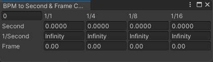
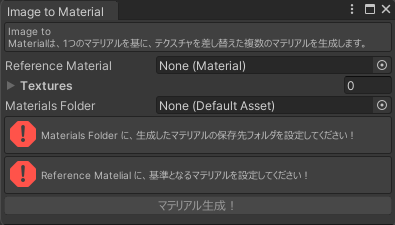
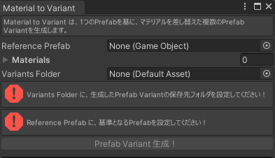

# Extensions

ここでは、PaLASOLUが提供するEditor拡張機能の使用や、設定を行うことができます。

## BPM to Second Frame Calculator

ウィンドウ左上にBPMの値を入力すると、自動的に「1/1(全音符)」「1/4(四分音符)」「1/8(八分音符)」「1/16(十六分音符)」の時間を表示します。

単位は「Second(秒)」「1/Second(毎秒)」「Frame(60FPS時のフレーム数)」の3種類です。

- Secondは、Particle SystemのDuration、Start Lifetime、Burst Timeなどで使用します。
- 1/Secondは、Particle SystemのRate Over Timeなどで使用します。
- FrameはTimeline上で使用します。

## Img 2 Mat / Mat 2 Variant (by anatawa12)

「思い出の写真をたくさんパーティクルライブに入れたい！」「画像だけが違うたくさんの3Dモデルが欲しい！」などの場合に役立ちます。

これら2つのツールは基本的にセットで使う想定です。

なお、本Extensionsは制作者である[anatawa12](https://github.com/anatawa12)氏より、zlibライセンスでの公開を特別に許諾していただいております。

### Img 2 Mat

マテリアルをたくさん作ります。

Reference Materialに基準となるマテリアルを、Texturesに基準となるマテリアルから差し替えたいテクスチャを、それぞれ入れます。テクスチャは複数枚に対応しています。

最後に、Materials Folderに出力先フォルダを指定して「マテリアル生成！」すると、テクスチャが差し替えられたマテリアルが生成されます。

### Mat 2 Variant

Prefab Variantをたくさん作ります。

Reference Prefabに基準となるPrefabを、Materialsに基準となるPrefabから差し替えたいマテリアルを、それぞれ入れます。マテリアルは複数に対応しています。

最後に、Variants Folderに出力先フォルダを指定して「Prefab Variant生成！」すると、マテリアル差し替えられたPrefab Variantが生成されます。

## Fix rotation for "Create Particle System"

通常、UnityでParticleSystemを右クリックメニューから生成した場合、`transform.rotate.x = -90`の状態で生成されます。

本機能は、ParticleSystemが生成された瞬間に、`transform.rotate.x = 0`に修正します。

ただし、「右クリックメニューから生成した場合」「Unityの画面上メニューの"GameObject"から生成した場合」以外は動きません。すなわち、パーティクルアセットなどを購入してPrefabを置いた場合などには機能しません。

:::info
本機能は可能な限り軽量に動作するよう設計していますが、Hierarchyの変更を監視しているのでEditor上の動作が若干重くなる可能性があります。

気になる場合は、本機能をOFFにしてください。
:::