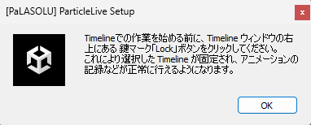

# Setup Optimization

Setup Optimizationは、パーティクルライブ用の設定済みPrefab、ならびにフォルダを生成します。

## いつ使うの？
パーティクルライブを新しく作り始める時！

## 使い方
"Tools/PaLASOLU/ParticleLive Setup"から、ウィンドウを出してください。

出てきたウィンドウに、楽曲名と、既にあれば楽曲ファイルを入力します。楽曲ファイルは後で手動でTimelineに入れることもできます。

最後に、「セットアップ！」を押します。

「Timelineでの作業を始める前に、Lockボタンを押してね！」というメッセージが出ます。よく読んで、「OK」を押します。

"[楽曲名]_ParticleLive"のGameObjectが出てくるので、このGameObjectの子になるようにパーティクルライブを制作しましょう！

アニメーションの記録は、同時に出てきた「Timeline」ウィンドウで行います。(このページではTimelineウィンドウの説明は省略します)

アバターをアップロードする際は、"[楽曲名]_ParticleLive"のGameObjectを、アバター直下に入れて、VRCSDKのアップロードボタンを押しましょう。

:::info[ポイント]
デフォルト設定では、"Assets/ParticleLive/[楽曲名]"フォルダが生成されます。パーティクルライブのために用意した画像やマテリアルなどの素材は、このフォルダに入れておくとよいでしょう。
:::

## 高度な設定

### Advanced Setup

[PaLASOLU Low-effort Uploader](LoweffortUploader)は、デフォルトで「ワールド固定」「パーティクルライブのON/OFF」などを自動でアバターメニューに追加します。

本オプションをONにすると、ワールド固定ギミックやON/OFFギミック用のPrefabを明示的に生成します。

これは、ワールド固定時に出現する観客位置目安用の棒を削除/加工したい場合や、LocalOnlyのObjectを使いたい場合などに有効です。

### Select Folder Directory

フォルダの生成場所を変更することができます。

フォルダ生成ウィンドウで選択したフォルダの配下に、楽曲名フォルダを生成します。もしくは、デフォルト設定では"Assets/ParticleLive"が選択されている、と考えてもよいです。

### Move AudioClip File to Particle Live Directory

生成されたフォルダに、楽曲ファイルを移動します。

明示的にチェックを付けない限り、ファイルの移動は発生しません。これは、「楽曲ファイルがなくなった！」というトラブルを防止するためです。

### Timeline Lock Notice

Setup Optimizationは、セットアップ時に「TimelineウィンドウをLockしてね！」という旨のバナーを表示します。このバナーを出すかどうかの設定です。