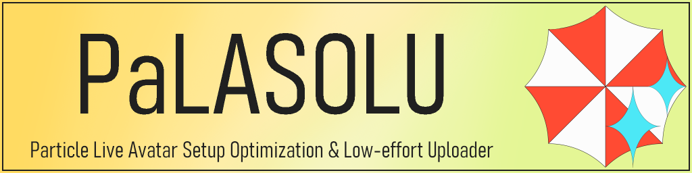

# PaLASOLU - Particle Live Avatar Setup Optimization & Low-effort Uploader

PaLASOLU(パラソル)は、**VRChatのパーティクルライブ向けに開発された、セットアップ&アップロード補助ツール**です。PaLASOLUを使うと、セットアップやアップロードの煩雑な工程をなくすことができます！

## インストール
VRChat Creator Companion(VCC)、もしくはALCOM経由でPaLASOLUをインストールすることをお勧めします。VCC/ALCOMをインストールしたら、こちらをクリックしてください : 

- [PaLASOLUをVCC/ALCOMに追加](vcc://vpm/addRepo?url=https://GlinTFraulein.github.io/vpm/index.json)

その後、プロジェクトの"manage project"を開き、PaLASOLUの+をクリックしてください。

……そう、Modular AvatarやAAOのインストールと同様です！VCC/ALCOM経由でアップデートも取得できます。

## インストール後
インストール後は以下のチュートリアルへお進みください。

- [はじめてのPaLASOLU](/PaLASOLU/First_PaLASOLU)

## おかしいな？と思ったら
PaLASOLUに対する質問や不具合報告は、[GlinTFrauleinのいろいろ](https://discord.gg/mBJaMr6yeK)で受け付けております。必ずメンションをつけてメッセージを送信してください！メンションがない場合、気づかないことがあります。

もしくは、[GitHub](https://github.com/GlinTFraulein/PaLASOLU)でIssue/Pull requestを投げていただいても構いません。